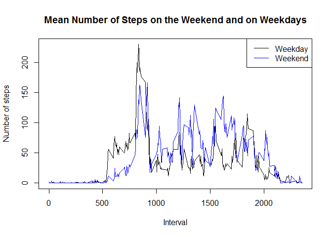

# Reproducible Research: Peer Assessment 1


## Loading and preprocessing the data

```r
activity<-read.csv("C:/Users/rkniukst/Documents/Data2/activity.csv")
head(activity)
```

```
##   steps       date interval
## 1    NA 2012-10-01        0
## 2    NA 2012-10-01        5
## 3    NA 2012-10-01       10
## 4    NA 2012-10-01       15
## 5    NA 2012-10-01       20
## 6    NA 2012-10-01       25
```

## What is mean total number of steps taken per day?
1) Calculate total number of steps taken each day

```r
totalsteps<-aggregate(steps ~ date, data=activity, sum)
totalsteps
```

```
##          date steps
## 1  2012-10-02   126
## 2  2012-10-03 11352
## 3  2012-10-04 12116
## 4  2012-10-05 13294
## 5  2012-10-06 15420
## 6  2012-10-07 11015
## 7  2012-10-09 12811
## 8  2012-10-10  9900
## 9  2012-10-11 10304
## 10 2012-10-12 17382
## 11 2012-10-13 12426
## 12 2012-10-14 15098
## 13 2012-10-15 10139
## 14 2012-10-16 15084
## 15 2012-10-17 13452
## 16 2012-10-18 10056
## 17 2012-10-19 11829
## 18 2012-10-20 10395
## 19 2012-10-21  8821
## 20 2012-10-22 13460
## 21 2012-10-23  8918
## 22 2012-10-24  8355
## 23 2012-10-25  2492
## 24 2012-10-26  6778
## 25 2012-10-27 10119
## 26 2012-10-28 11458
## 27 2012-10-29  5018
## 28 2012-10-30  9819
## 29 2012-10-31 15414
## 30 2012-11-02 10600
## 31 2012-11-03 10571
## 32 2012-11-05 10439
## 33 2012-11-06  8334
## 34 2012-11-07 12883
## 35 2012-11-08  3219
## 36 2012-11-11 12608
## 37 2012-11-12 10765
## 38 2012-11-13  7336
## 39 2012-11-15    41
## 40 2012-11-16  5441
## 41 2012-11-17 14339
## 42 2012-11-18 15110
## 43 2012-11-19  8841
## 44 2012-11-20  4472
## 45 2012-11-21 12787
## 46 2012-11-22 20427
## 47 2012-11-23 21194
## 48 2012-11-24 14478
## 49 2012-11-25 11834
## 50 2012-11-26 11162
## 51 2012-11-27 13646
## 52 2012-11-28 10183
## 53 2012-11-29  7047
```

2) Histogram of the total number of steps taken each day

```r
hist(totalsteps$steps, main="Histogram of Total Number of Steps Taken Each Day", xlab="Number of Steps")
```

 

3) Calculate the mean and median total number of steps taken each day

```r
mean1<- mean(totalsteps$steps,na.rm=TRUE)
mean1
```

```
## [1] 10766.19
```

```r
median1<-median(totalsteps$steps,na.rm=TRUE)
median1
```

```
## [1] 10765
```

## What is the average daily activity pattern?
1) Make a time series plot of the 5-minute interval and the average number of steps taken, averaged across all days

```r
interval<- aggregate(steps ~ interval, data=activity, FUN=function(x) {mean(x, na.rm=TRUE)})
plot(interval, type="l")
```

 

2) Which 5-minute interval, on average across all the days in the dataset, contains the maximum number of steps?

```r
interval$interval[which.max(interval$steps)]
```

```
## [1] 835
```

## Imputing missing values
1) Calculate and report the total number of missing values in the dataset

```r
sum(is.na(activity))
```

```
## [1] 2304
```

2) Devise a strategy for filling in all of the missing values in the dataset  
I will use the mean of the 5-minute interval to fill in missing values

3) Create a new dataset that is equal to the original dataset but with the missing data filled in

```r
for(i in 1:length(activity$steps)) {
  if(is.na(activity[i,1])) {
    avg <- subset(interval, interval == as.numeric(activity[i,3]))$steps
    activity[i,1] <- avg
  } else {
    activity[i,1] <- activity[i,1]
  }
}

head(activity)
```

```
##       steps       date interval
## 1 1.7169811 2012-10-01        0
## 2 0.3396226 2012-10-01        5
## 3 0.1320755 2012-10-01       10
## 4 0.1509434 2012-10-01       15
## 5 0.0754717 2012-10-01       20
## 6 2.0943396 2012-10-01       25
```

4) Make a histogram of total number of steps taken each day and calculate the mean and median total number of steps taken per day.  Do these values differ from the estimates in the first part of the assignment?  What is the impact of imputing missing data on the estimates of the total daily number of steps?

```r
totalsteps1<-aggregate(steps ~ date, data=activity, sum)
hist(totalsteps1$steps, main="Histogram of Total Number of Steps Taken Each Day", xlab="Number of Steps")
```

 

```r
mean2<-mean(totalsteps1$steps)
mean2
```

```
## [1] 10766.19
```

```r
median2<-median(totalsteps1$steps)
median2
```

```
## [1] 10766.19
```

The mean of the data ignoring missing values is 1.0766189\times 10^{4} and the mean with imputed data is 1.0766189\times 10^{4}.  These values are the same, so there is no impact of imputing missing data to the mean.

The mean of the data ignoring missing values is 10765 and the mean with imputed data is 1.0766189\times 10^{4}.  These values are off by 1.19, which is 0.01%.  The values are reasonably similar to think the imputed data doesn't make a big impact to the median.

## Are there differences in activity patterns between weekdays and weekends?
1) Create a new factor variable in the dataset with two levels - "weekday" and "weekend" indicating whether a given date is a weekday or weekend day

```r
activity$day <- weekdays(as.Date(as.character(activity$date)))
weekend <- activity$day == "Saturday" | activity$day == "Sunday"
activity$day[weekend] = "Weekend"
activity$day[!weekend] = "Weekday"

activityWD <- activity[activity$day == "Weekday", ]
activityWE <- activity[activity$day == "Weekend", ]
IntervalWD <- as.numeric(levels(as.factor(activityWD$interval)))
IntervalWE <- as.numeric(levels(as.factor(activityWE$interval)))
avgWD <- tapply(activityWD$steps, activityWD$interval, mean)
avgWE <- tapply(activityWE$steps, activityWE$interval, mean)
dfWD <- data.frame(avgWD, IntervalWD)
dfWE <- data.frame(avgWE, IntervalWE)
```

2) Make a panel plot containing a time series plot (i.e. type = "l") of the 5-minute interval (x-axis) and the average number of steps taken, averaged across all weekday days or weekend days (y-axis). See the README file in the GitHub repository to see an example of what this plot should look like using simulated data.

```r
plot(dfWD$IntervalWD, dfWD$avgWD, type="l", main="Mean Number of Steps on the Weekend and on Weekdays", xlab="Interval", ylab="Number of steps")
lines(dfWE$IntervalWE, dfWE$avgWE, col="blue")
legend("topright", c("Weekday", "Weekend"), col=c("black", "blue"), lty=1)
```

 
